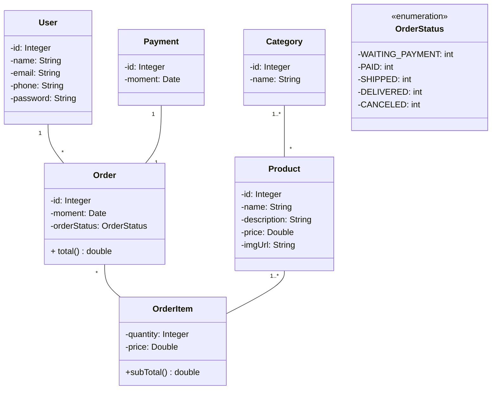

# Ecommerce API REST
Uma API REST desenvolvida com Spring boot para o dominio de um ecommerce.

## Modelo de dominio

```mermaid
classDiagram
    class User {
        -id: Integer
        -name: String
        -email: String
        -phone: String
        -password: String
    }
    class Payment {
        -id: Integer
        -moment: Date
    }
    class Category {
        -id: Integer
        -name: String
    }
    class Order {
        -id: Integer
        -moment: Date
        -orderStatus: OrderStatus
        + total() double
    }
    class Product { 
        -id: Integer
        -name: String
        -description: String
        -price: Double
        -imgUrl: String
    }
    class OrderItem {
        -quantity: Integer
        -price: Double
        +subTotal() double
    }
    class OrderStatus {
        <<enumeration>>
        -WAITING_PAYMENT: int
        -PAID: int
        -SHIPPED: int
        -DELIVERED: int
        -CANCELED: int
    }
    
    User "1"--"*" Order
    Payment "1"--"1" Order
    Category "1..*"--"*" Product
    Order "*"-- OrderItem
    Product "1..*"-- OrderItem
```